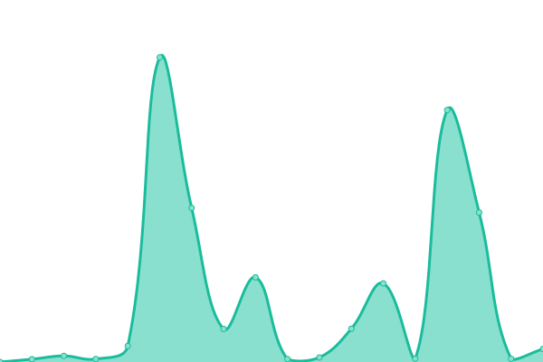
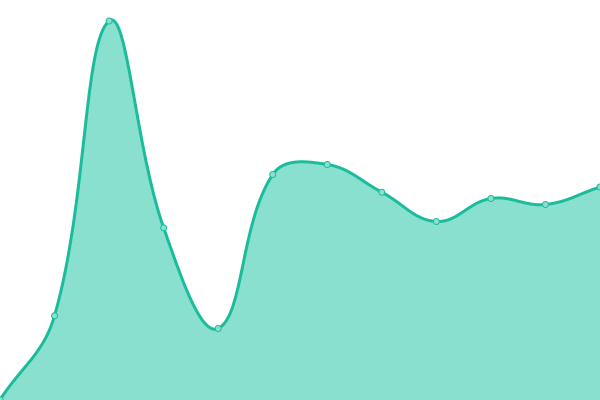

# [📈 Live Status](https://estado.unimonserrate.edu.co): <!--live status--> **🟧 Partial outage**

This repository contains the open-source uptime monitor and status page for [infraestructuraidt](https://estado.unimonserrate.edu.co), powered by [Upptime](https://github.com/upptime/upptime).

With [Upptime](https://upptime.js.org), you can get your own unlimited and free uptime monitor and status page, powered entirely by a GitHub repository. We use [Issues](https://github.com/infraestructuraidt/status/issues) as incident reports, [Actions](https://github.com/infraestructuraidt/status/actions) as uptime monitors, and [Pages](https://estado.unimonserrate.edu.co) for the status page.

<!--start: status pages-->
<!-- This summary is generated by Upptime (https://github.com/upptime/upptime) -->
<!-- Do not edit this manually, your changes will be overwritten -->
<!-- prettier-ignore -->
| URL | Status | History | Response Time | Uptime |
| --- | ------ | ------- | ------------- | ------ |
|  [Sitio WEB Unimonserrate](https://www.unimonserrate.edu.co/) | 🟩 Up | [sitio-web-unimonserrate.yml](https://github.com/infraestructuraidt/status/commits/HEAD/history/sitio-web-unimonserrate.yml) | 

 1600ms
     
 | 

<a href="https://estado.unimonserrate.edu.co/history/sitio-web-unimonserrate">99.82%</a>
    

|  [Olimpo 2.0](https://unimonserrate.ohelit.co/) | 🟩 Up | [olimpo-2-0.yml](https://github.com/infraestructuraidt/status/commits/HEAD/history/olimpo-2-0.yml) | 

 154ms
     
 | 

<a href="https://estado.unimonserrate.edu.co/history/olimpo-2-0">100.00%</a>
    

|  [Koha Estudiantes](https://unimonserrate-library.ohelit.co/) | 🟩 Up | [koha-estudiantes.yml](https://github.com/infraestructuraidt/status/commits/HEAD/history/koha-estudiantes.yml) | 

 544ms
     
 | 

<a href="https://estado.unimonserrate.edu.co/history/koha-estudiantes">79.50%</a>
    

|  [Koha Administrativos](https://unimonserrate-library-intra.ohelit.co/) | 🟩 Up | [koha-administrativos.yml](https://github.com/infraestructuraidt/status/commits/HEAD/history/koha-administrativos.yml) | 

 717ms
     
 | 

<a href="https://estado.unimonserrate.edu.co/history/koha-administrativos">77.44%</a>
    

|  [Revistas y publicaciones](https://revistas.unimonserrate.edu.co/) | 🟩 Up | [revistas-y-publicaciones.yml](https://github.com/infraestructuraidt/status/commits/HEAD/history/revistas-y-publicaciones.yml) | 

 666ms
     
 | 

<a href="https://estado.unimonserrate.edu.co/history/revistas-y-publicaciones">100.00%</a>
    

|  [CAU / CAE](https://mesadeayuda.unimonserrate.edu.co/) | 🟩 Up | [cau-cae.yml](https://github.com/infraestructuraidt/status/commits/HEAD/history/cau-cae.yml) | 

 624ms
     
 | 

<a href="https://estado.unimonserrate.edu.co/history/cau-cae">100.00%</a>
    

|  [Aulas virtuales](https://aulasvirtuales.unimonserrate.edu.co/) | 🟩 Up | [aulas-virtuales.yml](https://github.com/infraestructuraidt/status/commits/HEAD/history/aulas-virtuales.yml) | 

 699ms
     
 | 

<a href="https://estado.unimonserrate.edu.co/history/aulas-virtuales">99.80%</a>
    

|  [Uvirtual](https://uvirtual.unimonserrate.edu.co/) | 🟩 Up | [uvirtual.yml](https://github.com/infraestructuraidt/status/commits/HEAD/history/uvirtual.yml) | 

 706ms
     
 | 

<a href="https://estado.unimonserrate.edu.co/history/uvirtual">99.80%</a>
    

|  [Academusoft](https://academusoft.unimonserrate.edu.co/) | 🟩 Up | [academusoft.yml](https://github.com/infraestructuraidt/status/commits/HEAD/history/academusoft.yml) | 

 335ms
     
 | 

<a href="https://estado.unimonserrate.edu.co/history/academusoft">99.82%</a>
    

|  [Reportes](https://reportes.unimonserrate.edu.co/jasperserver/login.html) | 🟥 Down | [reportes.yml](https://github.com/infraestructuraidt/status/commits/HEAD/history/reportes.yml) | 

 1312ms
     
 | 

<a href="https://estado.unimonserrate.edu.co/history/reportes">99.99%</a>
    

<!--end: status pages-->

[**Visit our status website →**](https://estado.unimonserrate.edu.co)

## 📄 License

- Powered by: [Upptime](https://github.com/upptime/upptime)
- Code: [MIT](./LICENSE) © [infraestructuraidt](https://estado.unimonserrate.edu.co)
- Data in the `./history` directory: [Open Database License](https://opendatacommons.org/licenses/odbl/1-0/)
